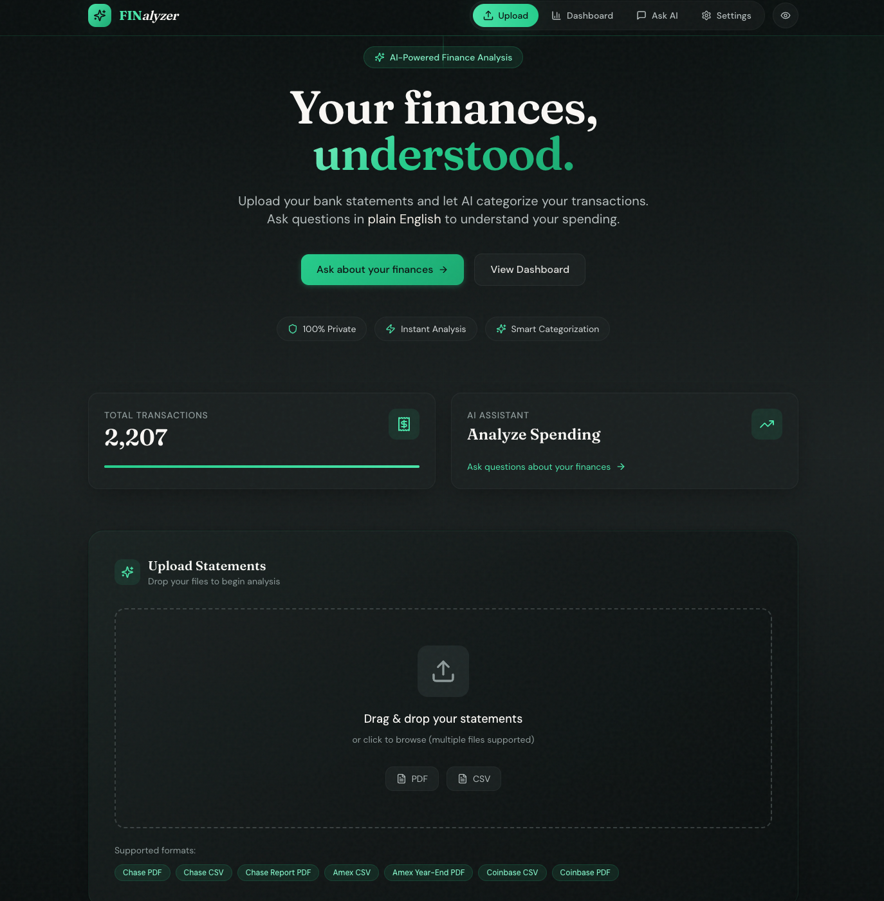
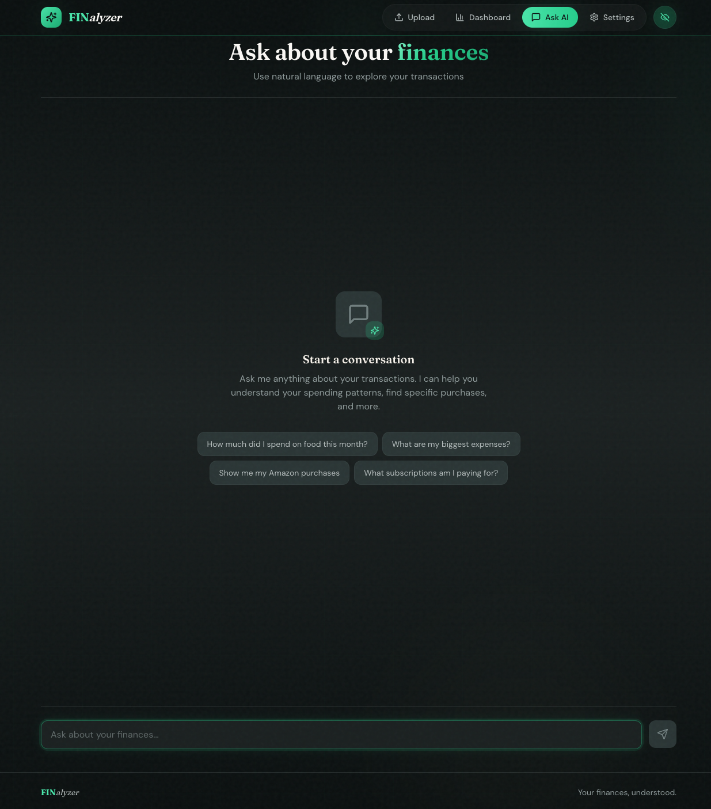
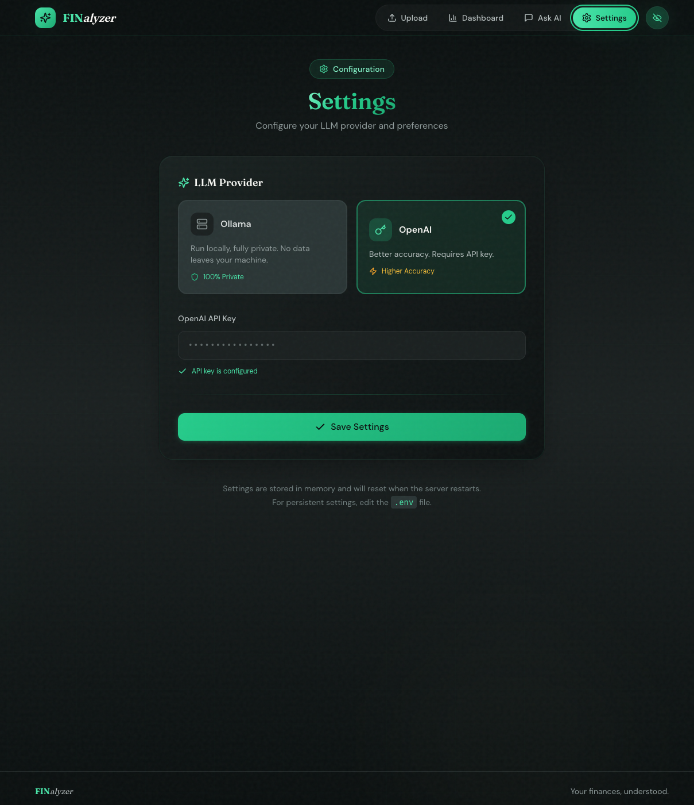

# FINalyzer

Personal finance analyzer with AI-powered categorization and natural language queries. All data stays local.

<table>
  <tr>
    <td></td>
    <td></td>
  </tr>
  <tr>
    <td></td>
    <td></td>
  </tr>
</table>

## Prerequisites

- Python 3.11+
- Node.js 18+
- [Ollama](https://ollama.ai/) (for local LLM) or OpenAI API key

## Quick Start

```bash
# Install everything (uv, node, dependencies)
make install

# Pull Ollama models (for local LLM)
ollama pull llama3.2
ollama pull nomic-embed-text

# Start the app
make dev
```

Open **http://localhost:3000**

### Using OpenAI Instead of Ollama

```bash
cp .env.example .env
```

Edit `.env`:
```
LLM_PROVIDER=openai
OPENAI_API_KEY=sk-...
```

## Supported Formats

The AI-powered generic parser automatically detects and processes financial statements from any institution in **PDF** or **CSV** format. No need to specify the source - it intelligently handles:

- Credit card statements (Chase, Amex, Discover, etc.)
- Bank statements
- Cryptocurrency exchange statements (Coinbase, etc.)
- Any other financial transaction records

## Commands

```bash
make dev       # Start backend + frontend
make test      # Run tests
make lint      # Lint code
make format    # Format code
make clean     # Remove ~/.finalyzer/ data
```

## Data Storage

All data stored locally in `~/.finalyzer/`

## License

MIT
